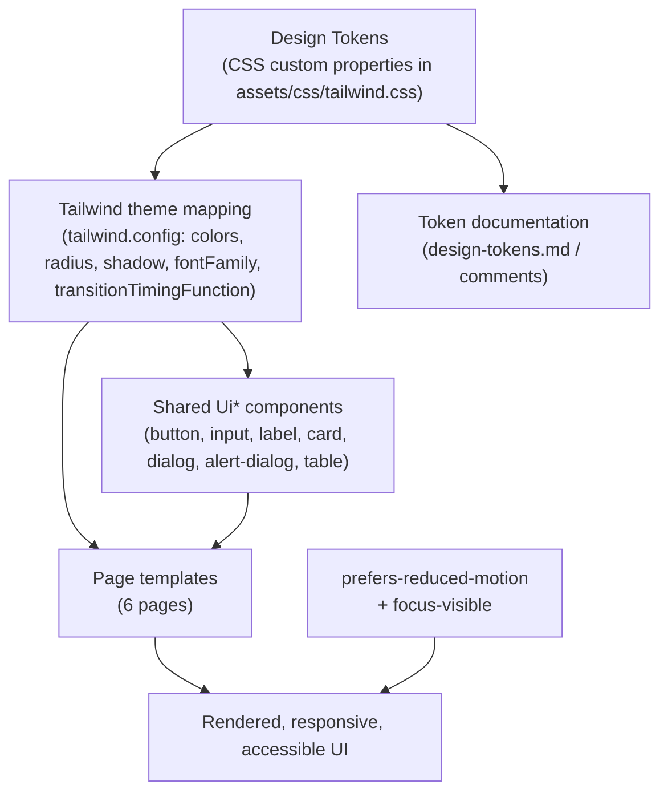

# Design Document

## Overview

This design delivers a complete visual and experiential redesign of all six user-facing pages of Quizly while preserving every existing behavior, route, server API interaction, client data flow, authentication mechanism, and Indonesian UI string. The work is strictly a look-and-feel change.

The foundation of the redesign is a **centralized design system** expressed as CSS custom properties (Design Tokens) in `assets/css/tailwind.css`, surfaced to Tailwind through the existing `tailwind.config` HSL-variable convention, and consumed uniformly by pages and the shared `Ui*` components. Today the codebase declares a small set of shadcn tokens but the pages ignore them — they hardcode ad-hoc color literals (`emerald-600`, `green-500`, near-black `zinc-*`, `slate-*`), gradients, radii, and shadows inline. The core architectural move of this redesign is to **invert that relationship**: define a rich, intentional token layer once, then refactor pages and components to reference tokens instead of ad-hoc values.

The redesign targets a distinctive, production-grade identity (not generic AI aesthetics): a **dark-forward** brand palette where **black/near-black is the dominant color** driving brand surfaces, structure, and the primary brand action, with **green acting as the neutral anchor / supporting accent** that ties the dark UI together (highlights, focus ring, selected/active states, key emphasis). This is formalized into named brand/accent/semantic tokens, a deliberate typographic hierarchy (display/heading/body/mono), a consistent elevation and radius rhythm, and a motion system with reduced-motion support. It emphasizes responsiveness (players overwhelmingly join on mobile), WCAG AA contrast, visible focus, keyboard operability, and engaging—but accessible—motion for the timed gameplay and the live leaderboard.

### Goals

- Establish a single source of truth for color, typography, spacing, radius, elevation, and motion.
- Apply one cohesive identity across all six pages and all shared `Ui*` components.
- Keep all logic, network calls, navigation, `localStorage` handling, and Indonesian copy unchanged.
- Meet WCAG AA contrast, visible focus, keyboard navigation, and reduced-motion requirements.
- Ensure responsive layouts with no overflow/clipping at mobile, tablet, and desktop breakpoints.
- Build cleanly with `npm run build`.

### Non-Goals

- No changes to server routes, scoring (`1000 + time_left * 10`), Supabase schema, Realtime subscriptions, or auth/session logic.
- No new features, routes, or copy (strings may be restyled, never reworded in meaning).
- No multi-theme (light/dark) toggle: the redesign delivers a **single dark theme** as the intended identity. The token structure remains theme-able, but only the one dark-forward theme is in scope; there is no separate light theme to switch to.

## Architecture

The redesign introduces a layered styling architecture. Lower layers define values; higher layers consume them. No layer reaches around the layer below it (e.g., pages must not hardcode hex/Tailwind palette colors that bypass tokens).



### Token flow

1. **Tokens** are declared as CSS custom properties under `:root` in `assets/css/tailwind.css`. Color tokens follow the existing shadcn convention of space-separated HSL channels (e.g., `--primary: 150 14% 9%` near-black, `--accent: 152 64% 44%` green) so they work with Tailwind's `hsl(var(--token))` mapping and `/<alpha>` opacity modifiers. Non-color tokens (radius scale, elevation/shadow, motion durations/easings, typography sizes) are declared as ready-to-use values.
2. **Tailwind mapping** in `tailwind.config` exposes tokens as utility classes: semantic colors (`bg-primary`, `text-muted-foreground`, `border-border`, `ring-ring`, plus new `brand`, `accent-2`, `success`, `warning`), a `borderRadius` scale tied to `--radius-*`, a `boxShadow` scale tied to `--shadow-*`, `fontFamily` entries for display/sans/mono, and `transitionTimingFunction`/`transitionDuration` entries for motion tokens.
3. **Components and pages** consume only these utilities (or `var(--token)` directly where a utility is impractical, e.g., a custom gradient). This satisfies Requirement 1.5 (reference tokens, not ad-hoc values).

### Refactor strategy (preserving behavior)

Each page is refactored template-only where possible. Vue `<script setup>` logic — `$fetch` calls, router navigation, timers, Realtime subscription, `localStorage` access, computed values, scoring display — is left intact. The redesign changes class attributes, element structure for layout/visual purposes, and adds presentational markup (icons, decorative containers), but never alters the reactive data model or the conditions under which API calls fire.

A shared visual scaffold is centralized so the six pages stay consistent:

- The atmospheric app background and the author attribution link already live in `app.vue`; these are retained (attribution per Requirement 13.6) and re-expressed with tokens.
- A small set of reusable presentational building blocks (e.g., a `BrandMark` for the Quizly logotype, an `AppShell`/centered-card layout pattern, a `Timer` ring) may be extracted to `~/components/` to avoid duplicated markup. These are presentational only and introduce no behavior.

## Design System and Design Tokens

This section defines the token catalog (Requirements 1 and 2). All tokens live in `assets/css/tailwind.css` and are documented in `design-tokens.md` at the repo root (Requirement 1.6).

### Color tokens (Requirement 1.1, 2.1, 10.1)

Color tokens are stored as HSL channels. The scheme is **dark-forward**: near-black neutrals dominate every base surface and the primary brand action, while a single green anchor supplies accents, highlights, focus, and active/selected emphasis. Pairings below are chosen to meet WCAG AA (≥ 4.5:1 for normal text, ≥ 3:1 for large text and UI boundaries). Because surfaces are near-black, **light foreground text yields very high contrast**; the green anchor is held at a lightness that keeps it AA-legible as text/icon on the dark surfaces, and is otherwise used as a large UI / decorative element (fills, rings, bars) where the ≥ 3:1 boundary rule applies.

| Token | Role | Example value (HSL channels) | Notes |
|-------|------|------------------------------|-------|
| `--background` | App/base background (dominant) | `150 14% 5%` | Near-black with a faint green tint; the dark atmospheric base |
| `--foreground` | Default text | `150 8% 95%` | Light; ≈ 16:1 on background |
| `--card` / `--card-foreground` | Surface + text on surface | `150 12% 8%` / `150 8% 95%` | Slightly elevated near-black surface; light text ≈ 14:1 |
| `--popover` / `--popover-foreground` | Overlays (dialogs) | mirrors card | |
| `--primary` / `--primary-foreground` | Primary brand action (dominant) | `150 12% 11%` / `150 8% 96%` | Near-black brand action; light text ≈ 12:1. Distinguished from the base by a green accent ring/border + brand shadow (≥ 3:1 UI boundary), not by fill contrast |
| `--brand` | Brand identity base (dominant) | `150 14% 8%` | Near-black; alias used by logotype/hero and the gradient base |
| `--accent` / `--accent-foreground` | **Green anchor**: highlights, selected/active states, hover surface | `152 64% 44%` / `150 40% 6%` | The neutral anchor that ties the dark UI together; dark text on green ≈ 6.5:1. As text/icon on dark surfaces ≈ 5:1 (AA) |
| `--accent-2` / `--accent-2-foreground` | Green secondary gradient stop | `152 64% 44%` / `150 40% 6%` | Alias of the green anchor; the supporting (non-dominant) terminus of the brand gradient |
| `--secondary` / `--secondary-foreground` | Low-emphasis surfaces | `150 10% 15%` / `150 8% 92%` | Dark elevated chip/surface |
| `--muted` / `--muted-foreground` | Muted bg + secondary text | `150 10% 13%` / `150 7% 66%` | muted-foreground ≈ 5.4:1 on card |
| `--success` / `--success-foreground` | Correct answer / positive | `122 55% 50%` / `150 40% 6%` | Grass green, distinct hue from the emerald accent anchor; dark text on it ≈ 7:1 |
| `--warning` / `--warning-foreground` | Timer urgency, caution | `38 95% 55%` / `40 40% 8%` | Amber; reads on dark |
| `--destructive` / `--destructive-foreground` | Errors / delete | `0 72% 55%` / `0 0% 100%` | Brightened for the dark base; "Salah!", error text, delete |
| `--border` | Borders/dividers | `150 10% 18%` | ≥ 3:1 against surfaces |
| `--input` | Input borders | `150 10% 20%` | |
| `--ring` | Focus indicator | `152 64% 44%` | High-contrast green focus ring (the anchor) |

A brand gradient is tokenized rather than re-typed per page: `--gradient-brand: linear-gradient(135deg, hsl(var(--brand)) 0%, hsl(var(--brand)) 55%, hsl(var(--accent-2)) 100%)` — a **near-black-dominant sweep that resolves into a green supporting stop**. Black occupies the majority of the gradient; green appears only as the trailing emphasis. This replaces the repeated `from-emerald-600 to-zinc-950` (formerly violet→fuchsia) literals.

**Accent green vs. success green distinction (per requirement):** now that green is the **accent anchor** (not the brand), the brand/primary is carried by near-black, so the previous "brand green vs. success green" split is reframed as **accent green vs. success green**. `--accent`/`--accent-2`/`--ring` is a deep emerald (hue ≈ 152, lightness 44%) used for highlights, focus, selected/active states, and the gradient's supporting stop; `--success` is a warmer, lighter grass green (hue ≈ 122, lightness 50%) reserved for correct-answer/positive semantics. The ~30° hue separation plus the differing lightness keeps the two greens visually distinguishable, so general accent emphasis is never mistaken for correctness feedback. To keep correctness feedback unambiguous against pervasive accent-green, **success always pairs its color with a non-color icon/text cue** (e.g., a check icon + Indonesian success copy), satisfying Requirement 10.5.

Semantic intent (success/error) always pairs color with a non-color cue elsewhere (icon/text) to satisfy Requirement 10.5.

### Typography tokens (Requirement 1.2, 2.2)

The app currently loads "Quicksand". The redesign formalizes a two-family system plus a numeric/mono treatment:

| Token | Purpose | Value |
|-------|---------|-------|
| `--font-display` | Hero/logotype/large headings | `"Clash Display", "Quicksand", sans-serif` (display family; Quicksand fallback keeps existing feel and avoids hard dependency) |
| `--font-sans` | Body and UI text | `"Quicksand", ui-sans-serif, system-ui, sans-serif` |
| `--font-mono` | Quiz codes, scores, timers | `"Space Mono", ui-monospace, "SFMono-Regular", monospace` |

Type scale (size / line-height / weight), exposed as tokens and Tailwind utilities:

| Level | Token group | Size | Line-height | Weight |
|-------|-------------|------|-------------|--------|
| Display (hero, brand) | `--text-display-*` | `clamp(2.5rem, 6vw, 3.75rem)` | 1.05 | 800 |
| Heading 1 (page title) | `--text-h1-*` | `1.875rem` | 1.15 | 800 |
| Heading 2 (section) | `--text-h2-*` | `1.25rem` | 1.25 | 700 |
| Heading 3 (card title) | `--text-h3-*` | `1.05rem` | 1.3 | 700 |
| Body | `--text-body-*` | `1rem` | 1.6 | 500 |
| Small/label | `--text-sm-*` | `0.8125rem` | 1.4 | 600 |

This provides the required ≥ 3 heading levels plus a body level, each with size/weight/line-height tokens. Numeric content (codes/scores/timer) uses `--font-mono` with `tabular-nums` for stable alignment.

### Spacing, radius, elevation tokens (Requirement 1.3)

- **Spacing scale**: a token ramp `--space-1 … --space-12` on a 4px base (4, 8, 12, 16, 20, 24, 32, 40, 48, 64). Tailwind's default spacing scale already aligns to 4px; the token ramp documents the canonical steps the redesign uses so spacing stays rhythmic rather than arbitrary.
- **Radius scale**: `--radius-sm: 0.5rem`, `--radius-md: 0.75rem`, `--radius-lg: 1rem`, `--radius-xl: 1.5rem`, `--radius-pill: 9999px`. The existing `--radius: 1rem` is retained and mapped to `--radius-lg`. Tailwind `borderRadius` maps to these so `rounded-lg`, `rounded-xl`, etc., are token-driven.
- **Elevation scale**: `--shadow-sm`, `--shadow-md`, `--shadow-lg`, `--shadow-brand` (a deep, dark, green-tinted glow — near-black drop shadow with a low-alpha green halo — replacing the repeated `shadow-emerald-500/25`, formerly `shadow-violet-500/25`). On the dark UI this reads as depth plus a subtle green edge-glow around primary actions. Mapped through Tailwind `boxShadow` so cards/buttons/dialogs share a consistent elevation language.

### Motion tokens (Requirement 1.4, 11)

| Token | Value | Use |
|-------|-------|-----|
| `--motion-fast` | `120ms` | Press/active feedback |
| `--motion-base` | `200ms` | Hover, color/opacity transitions |
| `--motion-slow` | `400ms` | Leaderboard reorder, larger state changes |
| `--ease-standard` | `cubic-bezier(0.4, 0, 0.2, 1)` | Default easing |
| `--ease-emphasized` | `cubic-bezier(0.2, 0, 0, 1)` | Entrances/celebratory |
| `--ease-spring` | `cubic-bezier(0.34, 1.56, 0.64, 1)` | Selection/pop micro-interactions |

These map to Tailwind `transitionDuration` and `transitionTimingFunction` so motion is consistent and centrally tunable. A global reduced-motion guard (below) neutralizes non-essential motion.

### Token documentation (Requirement 1.6)

`design-tokens.md` at the repo root documents every token: its name, value, intended usage, and the semantic situations in which to use it (e.g., "`--success` — correct-answer feedback, positive confirmation; always pair with check icon/text"). Inline comments in `assets/css/tailwind.css` group tokens by category.

## Visual Identity

The identity (Requirement 2) builds a confident "playful-but-precise" character on a **dark-forward** foundation:

- **Palette**: near-black neutrals (`--background`, `--card`, `--brand`, `--primary`) are the **dominant structural and brand color** — they own the backgrounds, surfaces, primary action, and the leading portion of the brand gradient. **Green is the neutral anchor / supporting accent** (`--accent`, `--accent-2`, `--ring`): it carries highlights, focus, selected/active states, key emphasis, and the gradient's trailing stop, but is never the dominant fill. Grass-green `--success` and red `--destructive` round out the semantics. The brand gradient token (near-black → green) is the signature element (hero icon tile, primary buttons, score card, brand wordmark), with black dominating the sweep.
- **Background treatment (Requirement 2.3, 2.4)**: `app.vue` keeps the atmospheric backdrop, re-expressed with tokens as a **dark atmospheric base** — near-black `--background` washed with low-alpha green radial glows (the accent anchor) for depth without lightening the surface. The same backdrop conventions apply to all six pages because they all render inside the `app.vue` shell, giving a consistent dark atmosphere.
- **Logotype (Requirement 2.5)**: the "Quizly" wordmark renders with `--font-display`. Against the dark base it uses light `--foreground` with a green accent detail (or the near-black→green brand gradient on large brand surfaces), so the logotype stays legible on the dark backdrop. A reusable `BrandMark` presentational component centralizes the icon tile + wordmark so it is identical wherever shown.
- **Cohesion (Requirement 2.4)**: identical token usage across pages — same near-black card surface (`bg-card`, `--shadow-md`, `--radius-xl`), same heading scale, same green focus ring, same motion — yields a unified dark feel from landing to leaderboard.

## Components and Interfaces

### Shared `Ui*` component restyling (Requirement 12)

Components are restyled by editing their `cva`/`cn` class strings to reference tokens. **Props, slots, variant names, sizes, and behavior are unchanged** (Requirement 12.2, 12.3). Pages that pass extra classes continue to work because `cn()` merges them.

| Component | Restyle approach | Preserved |
|-----------|------------------|-----------|
| `UiButton` (`button/index.ts` `buttonVariants`) | Update base + each variant to token utilities: `default` uses the near-black brand gradient/`bg-primary` + `--shadow-brand` green-edge glow + a green accent ring/border so the near-black action stays distinct on the dark base + spring press (`active:scale-[0.98]`); `outline`, `secondary`, `ghost`, `link`, `destructive` mapped to semantic tokens; selected/active and hover states use the green `--accent`; token-driven `rounded` and green focus ring (`focus-visible:ring-ring`). | All `variant` and `size` options (Req 12.3); `as`/`asChild` API |
| `UiInput` | Token border (`border-input`), token radius, larger comfortable height, token focus ring, `placeholder:text-muted-foreground`. | `v-model`, props |
| `UiLabel` | Token text color/weight, consistent spacing; ensures programmatic association via `for`/`id` usage in pages (Req 10.6). | props |
| `UiCard` (+ Header/Title/Content/Footer) | Token surface `bg-card`, `border-border`, `--shadow-md`, `--radius-xl`. | structure |
| `UiDialog` / `UiAlertDialog` (Content/Header/Title/Description/Footer/Action/Cancel) | Token popover surface, radius, elevation, backdrop; buttons use restyled `UiButton` tokens; motion via token durations/easing. | open/close API, triggers, Indonesian strings |
| `UiTable` (Header/Row/Head/Cell/Body) | Token text colors, token divider borders, token hover surface (`hover:bg-accent`), comfortable density. | structure, slots |

Because pages reference these components heavily, restyling them propagates the new identity broadly with minimal per-page churn.

### Reusable presentational components (new, behavior-free)

- `BrandMark.vue` — icon tile + gradient wordmark (used on landing, login, dashboard, result).
- `AnswerTimer.vue` — the SVG countdown ring extracted from the gameplay page; receives `timeLeft` and `total` as props and emits nothing. Applies `--warning` urgency styling at ≤ 5s. Logic (the interval) stays in the page; the component is pure presentation driven by props (Requirement 7.3, 7.4).
- `LeaderboardRow.vue` (optional) — presentational row with rank medal, current-player highlight, and reorder animation hook.

These are optional refactors to reduce duplication; if not extracted, the same token-based markup is inlined per page. Either way no behavior changes.

## Per-Page Redesign Approach

Each page keeps its `<script setup>` intact; only presentation changes.

### Landing / Join (`pages/index.vue`) — Requirement 3, 9.2

- Hero with `BrandMark`, atmospheric background, and the join `UiCard`.
- Retains strings: hero heading/tagline, labels "Nama Kamu" / "Kode Kuis", placeholders, button "Mulai Kuis", loading "Menghubungkan...", admin link "Masuk sebagai Admin", and error "Kode kuis tidak ditemukan." (Req 3.2, 3.5, 3.6).
- Join behavior (`POST /api/play/join` → navigate `/quiz/{id}`), in-progress disable, and error rendering are unchanged; error now uses `text-destructive` token styling (Req 3.3–3.5).
- Code input keeps the mono, uppercase, letter-spaced treatment via `--font-mono`.
- Mobile single column; primary controls ≥ 44×44px (input/button heights ≥ `h-12`) (Req 9.2).

### Admin Login/Register (`pages/admin/login.vue`) — Requirement 4, 9.2, 10.6

- Centered auth `UiCard` with `BrandMark`, mode-dependent Indonesian headings/descriptions, submit "Masuk"/"Buat Akun", and toggle text (Req 4.2–4.4).
- Toggling mode clears the error (existing behavior retained); error uses `text-destructive` (Req 4.4, 4.6).
- Submit calls `/api/auth/login` or `/api/auth/register` and navigates to `/admin`; `localStorage` token handling preserved (Req 4.5, 13.3).
- Inputs associated with `UiLabel` via `for`/`id` (Req 10.6).

### Admin Dashboard (`pages/admin/index.vue`) — Requirement 5, 9.3

- Header with greeting ("Halo, …"), "+ Buat Kuis Baru", and "Keluar" (Req 5.1).
- Quiz cards (`UiCard`) show title, question count, participant count, code, creation date with token styling (Req 5.2); empty state retains "Belum ada kuis" + description (Req 5.3).
- Create/edit/delete flows call the same endpoints and refresh logic; dialogs use restyled `UiDialog`/`UiAlertDialog` keeping Indonesian strings (Req 5.4–5.7).
- Desktop multi-column grid (`lg:grid-cols-3`), collapsing to single column on mobile (Req 9.3).

### Quiz Editor (`pages/admin/quiz/[id].vue`) — Requirement 6, 9.4

- Header: title, code with copy action (toggling "Salin Kode"/"Tersalin!" for the existing 2s), leaderboard visibility toggle (Req 6.1, 6.9).
- Stats summary cards: question count, participant count, average score, highest score (Req 6.2).
- Option-count selector (2–6), "Soal"/"Peserta" tabs with existing labels (Req 6.3).
- "Soal" tab: question list with options + add-question form; submitting adds via existing endpoint and refreshes; exactly one correct option indicated with `--success` styling (Req 6.4–6.7).
- Leaderboard toggle calls `PATCH` and reflects state visually (Req 6.8).
- "Peserta" tab: ranking in restyled `UiTable` with existing column headers (Req 6.10).
- Desktop multi-column arrangement (question list + sticky add-form: `lg:grid-cols-3`) (Req 9.4).

### Gameplay (`pages/quiz/[id]/index.vue`) — Requirement 7, 9.5, 10.5, 11.3

- Top bar: "Soal X/Y", running score (mono), `AnswerTimer` ring, progress bar — all token-styled (Req 7.1).
- Question card + options as large, tappable, distinct targets (Req 7.2).
- Timer updates each second and applies `--warning` urgency at ≤ 5s (Req 7.3, 7.4).
- Option select calls `POST /api/check-answer`; correct shows Indonesian success feedback with earned points (`1000 + time_left*10`) using `--success`; incorrect shows "Salah!" using `--destructive` (Req 7.5–7.7, 13.4).
- Correctness conveyed by icon + text in addition to color (Req 10.5).
- Final question triggers `POST /api/play/{id}/finish` → result page; loading indicator token-styled (Req 7.8, 7.9).
- Selection animates via spring motion token (Req 11.3); no horizontal scroll on mobile (`max-w-md`, single-column options) (Req 9.5).

### Result / Leaderboard (`pages/quiz/[id]/result.vue`) — Requirement 8, 9.2, 11.4

- Completion heading "Kuis Selesai!", player name, prominent score card (brand gradient, mono) (Req 8.1, 8.2).
- Leaderboard with rank/name/score when visible; current player's row distinguished; top three distinguished with medal treatment using tokens (Req 8.3–8.5).
- Realtime INSERT/UPDATE subscription unchanged; on update, the list refreshes and reorders with a motion-token transition (Req 8.6, 11.4).
- "LIVE" indicator retained; hidden-leaderboard message "Papan peringkat disembunyikan oleh admin." retained; back action "Kembali ke Beranda" retained (Req 8.7, 8.8, 8.2).

## Data Models

This redesign introduces no application/runtime data models and does not alter Supabase tables, server payloads, or client state shapes. The only "data" introduced is the **static design-token catalog**, modeled as CSS custom properties and their Tailwind mappings.

### Token catalog model (conceptual)

```
DesignToken
  name: string            // e.g. "--primary", "--shadow-brand", "--motion-base"
  category: "color" | "typography" | "spacing" | "radius" | "elevation" | "motion"
  value: string           // HSL channels for color; concrete CSS value otherwise
  usage: string           // documented intent (design-tokens.md)
  tailwindBinding?: string// utility/key it maps to (e.g. "bg-primary", "rounded-xl")
```

This model exists only as authored CSS/`tailwind.config` content and documentation; it is not consumed by application logic at runtime beyond standard CSS variable resolution.

### Preserved runtime models

Quiz, question, option, participant, and admin shapes; the `quizzes.is_leaderboard_visible` flag; `localStorage` keys (`participantName`, `participantId`, `adminToken`, `adminId`, `adminUsername`); and all server payloads remain exactly as they are today (Requirement 13.1, 13.3).

## Error Handling

The redesign preserves all existing error paths and only restyles their presentation:

- **Join failure** (`pages/index.vue`): unresolved code still sets and displays "Kode kuis tidak ditemukan.", now with `--destructive` token styling (Req 3.5).
- **Auth failure** (`pages/admin/login.vue`): the returned Indonesian message (or fallback "Terjadi kesalahan.") renders with `--destructive` styling; mode toggle clears it (Req 4.4, 4.6).
- **Gameplay answer errors**: a failed `check-answer` request still resolves to the incorrect state ("Salah!") as today; styling uses `--destructive` plus a non-color icon/text cue (Req 7.7, 10.5).
- **Admin CRUD failures**: existing silent `try/catch` behavior is preserved; no new error surfaces are introduced (scope is visual only).
- **Empty/edge states**: empty dashboard ("Belum ada kuis"), empty question list, and empty participant table retain their existing Indonesian messaging, restyled with tokens (Req 5.3, 6.x).
- **Reduced-motion**: a global `@media (prefers-reduced-motion: reduce)` rule disables/sharply shortens non-essential transitions and animations as a safe default, so motion never becomes an accessibility barrier (Req 11.5).
- **Missing display font**: `--font-display` lists "Quicksand" and system fallbacks, so the UI degrades gracefully if the display face fails to load.

## Testing Strategy

### PBT applicability assessment

I assessed whether property-based testing applies to this feature. **It does not.** Per the property-based-testing guidance, PBT is inappropriate for UI rendering, layout, CSS, and configuration-style work. This feature is, by definition, a visual/UX redesign: it defines design tokens (CSS custom properties), restyles components, adjusts layout/responsive structure, and tunes motion and accessibility presentation. It explicitly introduces **no new pure functions, parsers, serializers, transformations, or business logic** — all logic and data flows are preserved unchanged from the existing implementation. There is no meaningful "for all inputs X, property P(X) holds" statement over a large input space to verify; the acceptance criteria are about token definitions, visual treatment, rendered structure, contrast values, and preserved behavior/strings.

Consequently, the **Correctness Properties section is intentionally omitted**, and the prework tool was not run. Testing relies on build verification, example/unit checks, snapshot/visual regression, and manual accessibility/responsive review.

### Build verification (Requirement 13.5)

- `npm run build` must succeed. This is the primary automated gate and is run after the redesign is implemented. A failed build blocks completion.

### Token and configuration checks (Requirement 1, 10.1)

- **Contrast assertions (example/unit tests)**: a small Vitest test computes the WCAG contrast ratio for the defined foreground/background token pairings (foreground/background, primary/primary-foreground, accent/accent-foreground, muted-foreground/card, destructive/destructive-foreground, success/success-foreground) and asserts ≥ 4.5:1 for normal text (≥ 3:1 for large text / UI boundaries). It additionally checks the green anchor used as text/icon on the dark surfaces (accent-on-background, accent-on-card) and the primary-vs-background boundary (≥ 3:1, satisfied via the green ring/border rather than fill). These are concrete examples over a fixed, finite token set — not property tests.
- **Token presence check**: a lightweight test/script asserts that the required color tokens (Req 1.1) and the typography/spacing/radius/elevation/motion token groups (Req 1.2–1.4) are declared in `assets/css/tailwind.css`.
- **No-hardcoded-values guard (optional)**: a grep-style check flags reintroduced raw palette literals in page templates to enforce Req 1.5 — including raw greens (e.g., `emerald-600`, `green-500`), raw light-surface/text literals that would fight the dark theme (e.g., `bg-white`, `text-black`, light `slate-50`/`zinc-100`), raw near-black literals that should be `--background`/`--card`/`--primary` (e.g., `bg-zinc-950`, `bg-black`), any legacy `violet-*`/`fuchsia-*`, and hardcoded hex. Treated as advisory, not a hard gate.

### Component snapshot / visual checks (Requirement 12)

- Snapshot tests (or manual visual review) for restyled `Ui*` components confirm token classes are applied and that props/variants/sizes still render (Req 12.2, 12.3). Behavior is unchanged, so existing interaction contracts hold.

### Behavior & content preservation (Requirement 13)

- **Manual/regression walkthrough** of each page confirms: routes resolve; join, auth, CRUD, gameplay, finish, and Realtime flows fire the same endpoints; `localStorage` keys and `admin-auth` middleware behavior are unchanged; the scoring display matches `1000 + time_left*10`; and the `app.vue` author attribution link is present (Req 13.1, 13.3, 13.4, 13.6).
- **String preservation check**: a search-based check verifies the required Indonesian strings (e.g., "Mulai Kuis", "Menghubungkan...", "Kode kuis tidak ditemukan.", "Masuk", "Buat Akun", "Belum ada kuis", "Tersalin!", "Kuis Selesai!", "Skor Anda", "Kembali ke Beranda", "Papan peringkat disembunyikan oleh admin.", "LIVE", "Salah!") remain present in the templates (Req 13.2).
- Existing server unit tests (`npm test`, `server/**/*.test.ts`) must continue to pass, confirming the redesign did not touch server logic.

### Accessibility verification (Requirement 10, 11.5)

- **Keyboard navigation**: manual tab-through of each page confirms every primary interactive element is reachable/activatable in a logical order with a visible focus indicator (Req 10.2, 10.3).
- **Icon-only controls**: verify `aria-label`s exist on icon-only buttons (edit/delete/copy/correct-option) (Req 10.4).
- **Non-color cues**: confirm gameplay correctness feedback includes icon + text, not color alone (Req 10.5).
- **Reduced motion**: with `prefers-reduced-motion: reduce`, confirm non-essential animation is minimized (Req 11.5).
- Full WCAG conformance requires manual testing with assistive technologies and expert review; automated contrast checks cover only the token-pairing criterion.

### Responsive verification (Requirement 9)

- Manual/visual checks at mobile, tablet, and desktop breakpoints confirm: single-column layouts on mobile for landing/login/result with ≥ 44×44px primary targets; multi-column dashboard grid and editor arrangement at desktop; no horizontal scroll in gameplay on mobile; and no overflow/clipping on any of the six pages at any breakpoint (Req 9.2–9.6).

## Requirements Mapping

| Requirement | Addressed by |
|-------------|--------------|
| 1. Centralized design system & tokens | Design System and Tokens; Architecture (token flow); `design-tokens.md` |
| 2. Distinctive visual identity | Visual Identity; color & typography tokens; brand gradient; `BrandMark` |
| 3. Landing/join redesign | Per-Page: Landing; Error Handling (join) |
| 4. Login/register redesign | Per-Page: Login; Error Handling (auth) |
| 5. Admin dashboard redesign | Per-Page: Dashboard; `Ui*` restyling (dialogs) |
| 6. Quiz editor redesign | Per-Page: Quiz Editor; `UiTable` restyling |
| 7. Gameplay redesign | Per-Page: Gameplay; `AnswerTimer`; motion tokens |
| 8. Result & live leaderboard | Per-Page: Result; motion (reorder) |
| 9. Responsive layout | Responsive notes per page; Testing: responsive verification |
| 10. Accessibility | Color tokens (contrast); focus ring token; Testing: accessibility |
| 11. Motion & micro-interactions | Motion tokens; reduced-motion guard; per-page motion |
| 12. Shared component restyling | Components and Interfaces (`Ui*` restyling) |
| 13. Functional & content preservation | Refactor strategy; Error Handling; Testing: preservation |
